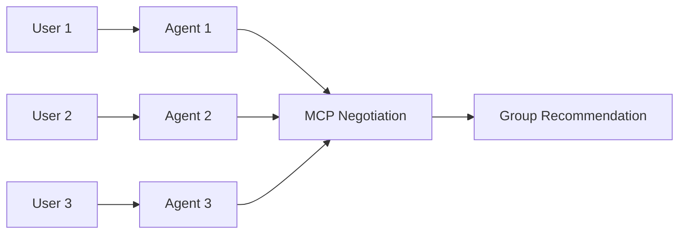
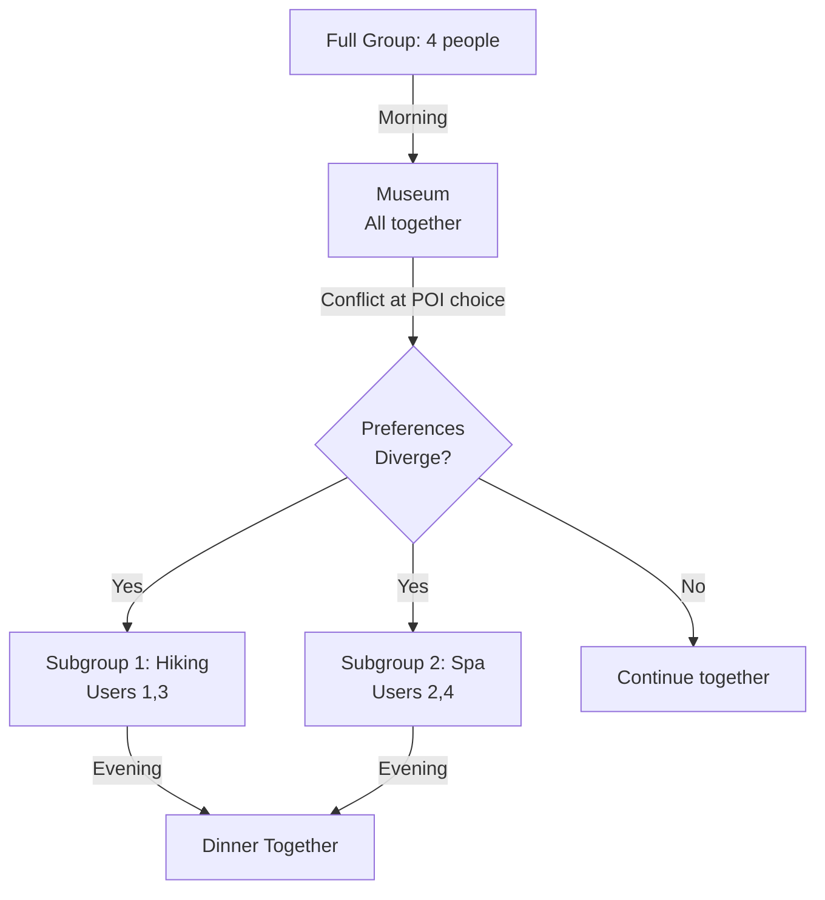
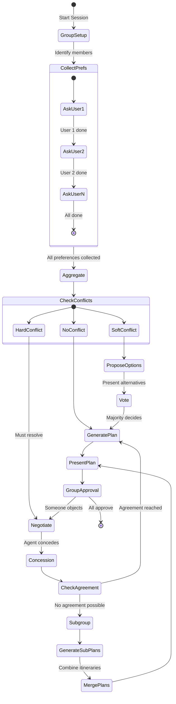

# Literature Review: Group-Based Travel Recommendation Systems

## Overview

This review synthesizes two key papers on **group travel recommendation** that inform the design of a **group-based dialogue system** for multi-city travel planning.

---

## Paper 1: PUMAS-GR - Multi-Agent Negotiation Approach

**Title**: A MAS Approach for Group Recommendation Based on Negotiation Techniques  
**Authors**: Villavicencio, Schiaffino, Diaz-Pace, Monteserin, Demazeau, Adam  
**Source**: PAAMS 2016 (Springer LNAI 9662, pp. 219-231)  
**Domain**: Movies (applicable to travel)

### Core Concept
Each user is represented by a **personal agent** that knows their preferences and **negotiates** with other agents to find group consensus.

### Architecture



### Multilateral Monotonic Concession Protocol (MCP)

| Step | Description |
|------|-------------|
| 1. Initial Proposals | Each agent proposes their top-ranked item |
| 2. Check Agreement | Agreement if any proposal is acceptable to ALL agents |
| 3. Concession | If no agreement, one agent makes a concession (proposes inferior item) |
| 4. Repeat | Continue until agreement or conflict (no more concessions possible) |

**Agreement Criterion**: Agent `i`'s proposal is accepted if for ALL agents `k`:
```
U_k(proposal_i) >= U_k(current_proposal_k)
```

### Concession Strategies

**1. Zeuthen Strategy** - Determines WHO concedes:
```
WRC_i = (U_i(x_i) - min{U_i(x_k) | k ∈ A}) / U_i(x_i)
```
- Agent with lowest WRC (Willingness to Risk Conflict) must concede
- Leads to Nash-optimal agreements

**2. Concession Amount** - Determines WHAT to propose next:

| Strategy | Description | Properties |
|----------|-------------|------------|
| **Nash** | Propose item that maximizes product of others' utilities | Guarantees termination, deadlock-free |
| **Desires Distance (DD)** | Propose item closest to others' top desires | Better empirical results |

### Key Innovation: Desires Distance (DD)
```
dd_value(X_ij) = Σ |U_k(X_ij) - U_k(X_k)|  when U_k(X_ij) - U_k(X_k) < 0
```
- Measures how far a proposal is from satisfying others
- Agent proposes item with lower dd_value than current proposal

### Experimental Results (MovieLens 100k)

| Metric | PUMAS-GR (DD) vs Baseline |
|--------|---------------------------|
| Average satisfaction | **+8-9%** higher |
| Std deviation | **-25%** lower (more even) |
| Time overhead | 9-57s vs 8-10s (acceptable) |

### Threats to Validity
1. Random group formation (ignored relationships)
2. Reliance on Duine framework for ratings
3. Average used for group utility (other methods may differ)

---

## Paper 2: GTTRM - Ant Colony Optimization with Subgroups

**Title**: A Novel Group Tour Trip Recommender Model for Personalized Travel Systems  
**Authors**: Alatiyyah  
**Source**: PeerJ Computer Science 11:e2589 (2025)  
**DOI**: 10.7717/peerj-cs.2589

### Core Problem: Group Tour Trip Design Problem (GTTDP)
Create itineraries for groups with diverse preferences while:
- Maximizing group satisfaction
- Minimizing conflicts
- Allowing **dynamic subgroup formation**

### Two Aggregation Methods

| Method | Approach | Best For |
|--------|----------|----------|
| **Group Aggregation (GA)** | Merge all preferences into single profile | Similar preferences |
| **User Aggregation (UA)** | Keep individual profiles, algorithm forms subgroups | Diverse/conflicting preferences |

### Constraints Data Model (CDM)

**Hard Constraints (HC)** - Binary (0/1):
```
ActHC[pti][uz] = Π hc(Act)[ptim][uz]  (product of all HCs)
ActHC[pti][G] = Π ActHC[pti][uz]       (group = product over users)
```
> If ANY user has HC=0, group score is 0 (respects all vetoes)

**Soft Constraints (SC)** - Weighted preferences [0,1]:

| Method | Formula |
|--------|---------|
| Sum | Σ W_v × sc(Act)[ptim][uz] |
| Least Misery | min(ActSC[uz]) |
| Most Pleasure | max(ActSC[uz]) |
| Multiplicative | Π W_v × sc(Act)[ptim][uz] |

### Mathematical Model

**Objective Function**:
```
Maximize: f1(activity) + f2(connection) + f3(waiting)
```

Where:
- `f1(a)` = Σ X[pti][uz] × A[pti][uz] + social bonus for co-visiting
- `f2(c)` = Σ Y[ptij][uz] × C[ptij][uz] + social bonus for traveling together
- `f3(w)` = Σ Z[pt][uz] × W[pt][uz] (waiting satisfaction)

**Social Satisfaction**: If user `uz` travels with `uo`:
```
ActG[pti][uz,uo] × V[uz,uo]  (V = social relationship value)
```

### Group Ant Colony Optimization (GACO)

**Probability of choosing next POI**:
```
P[ij][uz] = (τ[ij]^α × η[ij]^β × Σλ[ij][uz,uo]^γ) / normalization
```
Where:
- `τ` = pheromone trail (learned from good paths)
- `η` = heuristic (activity score / travel time)
- `λ` = social preference for traveling with specific group members

**Pheromone Updates**:
- Local: `τ[ij] = (1-ρ) × τ[ij] + δ[ij]`
- Global: reinforces best solutions

### Dynamic Subgroup Formation



### Key Findings

1. **UA outperforms GA** mid-trip when preferences diverge
2. First/second travelers show higher satisfaction (social hierarchy)
3. Model optimizes three activities: visiting, traveling, waiting

### Limitations
- Requires accurate preference data upfront
- Frequent preference changes → computational overhead
- Doesn't model interpersonal hierarchies (who defers to whom)

---

## Comparative Analysis

| Aspect | PUMAS-GR | GTTRM |
|--------|----------|-------|
| **Approach** | Multi-agent negotiation | Optimization (ACO) |
| **Fairness** | Explicit (concession protocol) | Implicit (satisfaction weighting) |
| **Subgroups** | No | Yes (dynamic) |
| **Social relations** | Not modeled | Modeled via V[uz,uo] |
| **Real-time adaptation** | Round-by-round | Subgroup re-formation |
| **Complexity** | Higher (multiple rounds) | O(Iterations × Ants × TripLength) |

---

## Key Concepts for Group Dialogue System

### 1. Constraint Classification

```json
{
  "user_id": "traveler_1",
  "hard_constraints": {
    "must_visit": ["Taj Mahal"],
    "avoid": ["high_altitude"],
    "dietary": "vegetarian"
  },
  "soft_constraints": {
    "cuisine": {"weight": 0.8, "value": "Indian"},
    "activity": {"weight": 0.6, "value": "cultural"},
    "budget": {"weight": 0.9, "value": "moderate"}
  },
  "social": {
    "prefer_with": ["traveler_2"],
    "relationship": "spouse"
  }
}
```

### 2. Aggregation Strategy Selection

| Group Profile | Recommended Strategy |
|--------------|---------------------|
| Homogeneous preferences | Average or Sum |
| One dominant member | Most Respected Person |
| Need fairness | PUMAS negotiation or Least Misery |
| Diverse, flexible group | GTTRM with UA + subgroups |

### 3. Conflict Detection & Resolution

```python
def detect_conflict(users_constraints):
    conflicts = []
    for slot in ["cuisine", "attraction", "accommodation"]:
        values = [u.get(slot) for u in users_constraints]
        if len(set(values)) > 1:  # Different preferences
            conflicts.append({
                "slot": slot,
                "options": set(values),
                "type": "preference_divergence"
            })
    # Hard constraint conflicts (mutually exclusive)
    for u1, u2 in combinations(users_constraints, 2):
        if u1.must_visit & u2.avoid:
            conflicts.append({
                "type": "hard_conflict",
                "users": [u1.id, u2.id],
                "detail": u1.must_visit & u2.avoid
            })
    return conflicts
```

### 4. Proposed Group Dialogue Flow



### 5. New Dialogue Intents for Groups

| Intent | Description |
|--------|-------------|
| `sys_identify_group` | Determine group composition |
| `sys_request_user_preference` | Ask specific user for input |
| `sys_detect_conflict` | Surface preference conflicts |
| `sys_propose_alternatives` | Present compromise options |
| `sys_initiate_vote` | Let group vote on options |
| `sys_suggest_subgroup` | Propose temporary split |
| `user_delegate` | User defers to another member |
| `user_veto` | User blocks an option (hard constraint) |
| `group_approve` | All members confirm plan |

---

## Implementation Considerations

### For Your Current System

Your `dialogue_generator_MULTICITYV1_FIXED.py` already handles:
- Per-city constraint overrides (`city_overrides`)
- Slot-by-slot preference collection
- Conflict detection for individual users

**Extensions needed for groups**:

1. **Multi-user session state**:
   ```python
   group_state = {
       "members": ["user_1", "user_2", "user_3"],
       "preferences": {
           "user_1": {...},
           "user_2": {...},
       },
       "conflicts": [],
       "resolved": {},
       "subgroups": None
   }
   ```

2. **Aggregation layer** (before calling planner):
   ```python
   def aggregate_preferences(group_state, strategy="least_misery"):
       if strategy == "least_misery":
           return {slot: min(prefs) for slot, prefs in ...}
       elif strategy == "negotiation":
           return run_mcp_negotiation(group_state)
   ```

3. **Subgroup formation** (when conflicts unresolvable):
   ```python
   def form_subgroups(group_state, conflict_slot):
       clusters = cluster_by_preference(group_state, conflict_slot)
       return [generate_plan(sg) for sg in clusters]
   ```

---

## References

1. Villavicencio et al. (2016) - PUMAS-GR (PAAMS)
2. Alatiyyah (2025) - GTTRM (PeerJ CS)
3. Masthoff (2011) - Group recommender systems: combining individual models
4. Baltrunas et al. (2010) - Rank aggregation approaches
5. Endriss (2006) - Monotonic concession protocols (AAMAS)
